# Guide d'installation et de configuration de Keycloak

## Introduction

Ce guide décrit les étapes d'installation et de configuration de Keycloak pour l'authentification et la gestion des utilisateurs dans le projet **c2s**. Vous y apprendrez comment intégrer Keycloak et configurer les clients front-end et back-end.

## Prérequis

Avant de commencer, assurez-vous d'avoir :

- **Node.js** et **npm** installés.
- Un accès au projet GitHub (Front-end : [c2s-front](https://github.com/DNUM-SocialGouv/c2s-front) / Back-end : [c2s-back](https://github.com/DNUM-SocialGouv/c2s-back)).
- Les installations front-end et back-end effectuées (voir fichier `installation.md`).
- **pgAdmin** installé et une base de données `espace_authentifie` créée.

## 1. Installation de Keycloak

### 1.1. Téléchargement et installation de Keycloak

1. Téléchargez Keycloak à partir de [ce lien](https://www.keycloak.org/downloads).
2. Modifiez le fichier `conf/keycloak.conf` pour y renseigner les informations de votre base de données PostgreSQL. Exemple de configuration :

```
db=postgres
db-username=${DATABASE_USERNAME}
db-password=${DATABASE_PASSWORD}
db-url=jdbc:postgresql://localhost:5432/espace_authentifie?keycloak
hostname-url=http://localhost:8080
hostname-admin-url=http://localhost:8080
http-enabled=true

```

### 1.2. Intégration du thème Keycloak c2s

1. Clonez le thème Keycloak c2s depuis [ce dépôt GitHub](https://github.com/DNUM-SocialGouv/c2s-keycloak-theme).
2. Renommez le dossier cloné en `c2stheme`.
3. Déplacez-le dans le répertoire `themes` du package Keycloak.

## 2. Démarrage et création du Realm Keycloak

### 2.1. Démarrer le serveur Keycloak

1. Dans le répertoire racine de Keycloak, exécutez la commande suivante pour démarrer le serveur en mode développement :

```bash
bin/kc.sh start-dev

```

1. Ouvrez [http://localhost:8080/](http://localhost:8080/) dans votre navigateur pour accéder à l'interface d'administration.
2. Créez un compte administrateur ou utilisez un compte existant.

### 2.2. Créer un Realm Keycloak

1. Dans le menu latéral, cliquez sur **Create Realm**.
2. Nommez le nouveau Realm `c2s-realm` et validez.

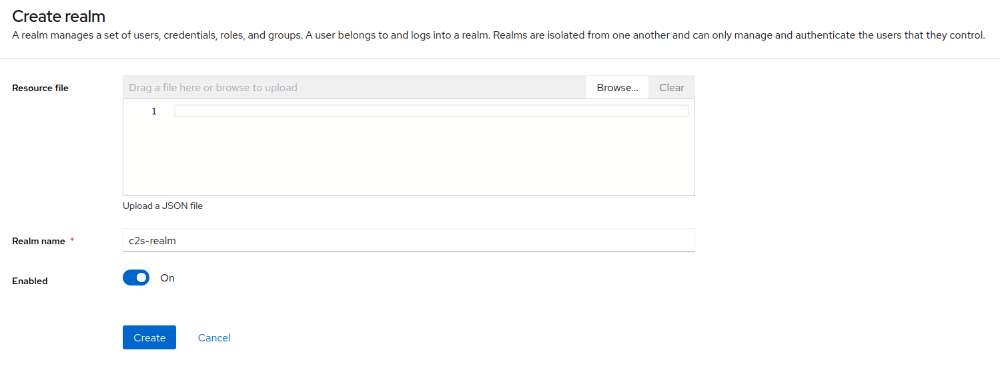

> Note : N'oubliez pas de sélectionner le Realm "c2s-realm" dans la barre latérale pour les opérations suivantes.

## 3. Configuration du Realm

### 3.1. Création du client front-end (c2s-oc)

Les clients représentent les applications qui demandent à Keycloak d'authentifier des utilisateurs.

1. Allez dans l'onglet **Clients** et cliquez sur **Create Client**.
2. Entrez `c2s-oc` comme **Client ID** et laissez les options par défaut.
3. Dans **Login Settings**, configurez les URLs suivantes :
   - **Root URL** : `http://localhost:8080/mon-espace`
   - **Home URL** : `http://localhost:8080/mon-espace/*`
   - **Valid redirect URIs** : ``
   - **Web origins** : ``

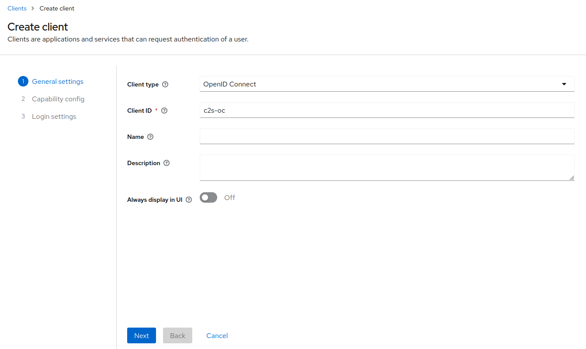

1. Une fois le client créé, sélectionnez le thème `c2stheme` pour personnaliser l'interface.

Exemple de configuration JSON du client `c2s-oc` :

```json
{
  "clientId": "c2s-oc",
  "name": "",
  "description": "",
  "rootUrl": "http://localhost:8080/mon-espace",
  "adminUrl": "http://localhost:8080/mon-espace",
  "baseUrl": "http://localhost:8080/mon-espace/*",
  "surrogateAuthRequired": false,
  "enabled": true,
  "alwaysDisplayInConsole": false,
  "clientAuthenticatorType": "client-secret",
  "redirectUris": ["*"],
  "webOrigins": ["*"],
  "notBefore": 0,
  "bearerOnly": false,
  "consentRequired": false,
  "standardFlowEnabled": true,
  "implicitFlowEnabled": false,
  "directAccessGrantsEnabled": true,
  "serviceAccountsEnabled": false,
  "publicClient": true,
  "frontchannelLogout": true,
  "protocol": "openid-connect",
  "attributes": {
    "oidc.ciba.grant.enabled": "false",
    "backchannel.logout.session.required": "true",
    "login_theme": "c2stheme",
    "display.on.consent.screen": "false",
    "oauth2.device.authorization.grant.enabled": "false",
    "backchannel.logout.revoke.offline.tokens": "false"
  },
  "authenticationFlowBindingOverrides": {},
  "fullScopeAllowed": true,
  "nodeReRegistrationTimeout": -1,
  "defaultClientScopes": [
    "web-origins",
    "acr",
    "profile",
    "roles",
    "basic",
    "email"
  ],
  "optionalClientScopes": [
    "address",
    "phone",
    "offline_access",
    "microprofile-jwt"
  ],
  "access": {
    "view": true,
    "configure": true,
    "manage": true
  }
}
```

### 3.2. Création du client back-end (c2s-backend-oidc)

1. Allez dans l'onglet **Clients** et cliquez sur **Create Client**.
2. Entrez `c2s-backend-oidc` comme **Client ID**.
3. À l'étape **Login Settings**, configurez les URLs :
   - **Valid redirect URIs** : `/*`
   - **Web origins** : `/*`

Exemple de configuration JSON du client `c2s-backend-oidc` :

```json
{
  "clientId": "c2s-backend-oidc",
  "name": "",
  "description": "",
  "rootUrl": "",
  "adminUrl": "",
  "baseUrl": "",
  "surrogateAuthRequired": false,
  "enabled": true,
  "alwaysDisplayInConsole": false,
  "clientAuthenticatorType": "client-secret",
  "secret": "18407stNnZjBeOEyeHrAfTNLZb52xidx",
  "redirectUris": ["/*"],
  "webOrigins": ["/*"],
  "notBefore": 0,
  "bearerOnly": false,
  "consentRequired": false,
  "standardFlowEnabled": true,
  "implicitFlowEnabled": false,
  "directAccessGrantsEnabled": true,
  "serviceAccountsEnabled": false,
  "publicClient": false,
  "frontchannelLogout": true,
  "protocol": "openid-connect",
  "attributes": {
    "oidc.ciba.grant.enabled": "false",
    "client.secret.creation.time": "1726219878",
    "backchannel.logout.session.required": "true",
    "display.on.consent.screen": "false",
    "oauth2.device.authorization.grant.enabled": "false",
    "backchannel.logout.revoke.offline.tokens": "false"
  },
  "authenticationFlowBindingOverrides": {},
  "fullScopeAllowed": true,
  "nodeReRegistrationTimeout": -1,
  "defaultClientScopes": [
    "web-origins",
    "acr",
    "profile",
    "roles",
    "basic",
    "email"
  ],
  "optionalClientScopes": [
    "address",
    "phone",
    "offline_access",
    "microprofile-jwt"
  ],
  "access": {
    "view": true,
    "configure": true,
    "manage": true
  }
}
```

## 4. Configuration des rôles

### 4.1. Création du rôle “CAISSE”

1. Dans le menu latéral, allez dans **Realm Roles** puis cliquez sur **Create role**.
2. Entrez `CAISSE` comme nom et la description “Caisse d'assurance maladie”. Sauvegardez le rôle.

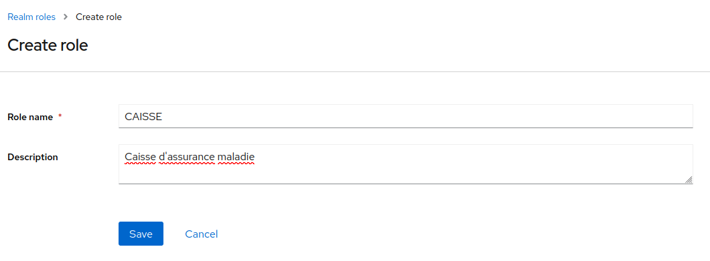

### 4.2. Création du rôle “MODERATEUR”

1. Dans **Realm Roles**, cliquez sur **Create role**.
2. Entrez `MODERATEUR` comme nom et la description “Modérateur”. Sauvegardez.

### 4.3. Création du rôle “ORGANISME_COMPLEMENTAIRE”

1. Dans **Realm Roles**, cliquez sur **Create role**.
2. Entrez `ORGANISME_COMPLEMENTAIRE` comme nom et la description “Organisme complémentaire”. Sauvegardez.

## 5. Création des utilisateurs

### 5.1. Création de l’utilisateur “c2s_user_back”

1. Dans le menu **Users**, cliquez sur **Add user**.
2. Remplissez les champs :
   - **Username** : `c2s_user_back`
   - **Email** : `c2s_user_back@admin.com`
   - **First name** : `c2s_user_back`
   - **Last name** : `admin`
   - Cochez **Email verified**.

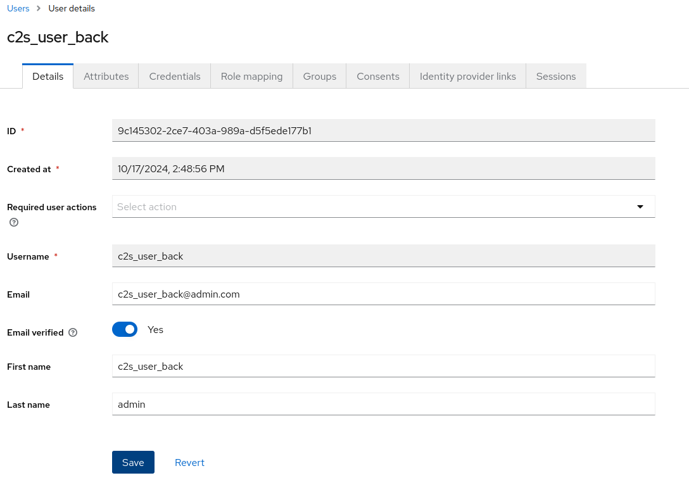

### 5.2. Définition des credentials

1. Allez dans l'onglet **Credentials**.
2. Définissez un mot de passe, décochez **Temporary**, puis sauvegardez.

### 5.3. Attribution des rôles de “c2s_user_back”

1. Allez dans l'onglet **Role mappings**.
2. Cliquez sur **Assign role**, filtrez par clients, et attribuez les rôles :
   - `realm-management view-users`
   - `realm-management manage-users`
   - `realm-management manage-clients`
   - `realm-management realm-admin`
   - `offline_access`

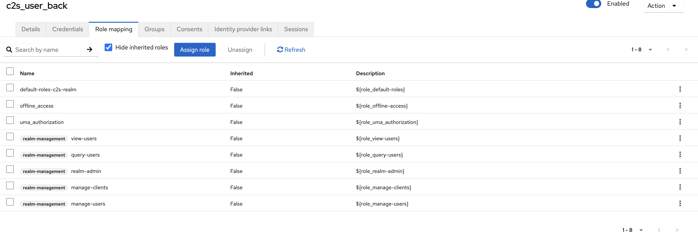

### 5.4. Création de l’utilisateur “c2s_user_caisse”

1. Dans **Users**, cliquez sur **Add user**.
2. Remplissez les champs :
   - **Username** : `c2s_user_caisse`
   - **Email** : `c2s_user_caisse@c2s.com`
   - **First name** : `Caisse`
   - **Last name** : `C2S USER`
   - Cochez **Email verified**.

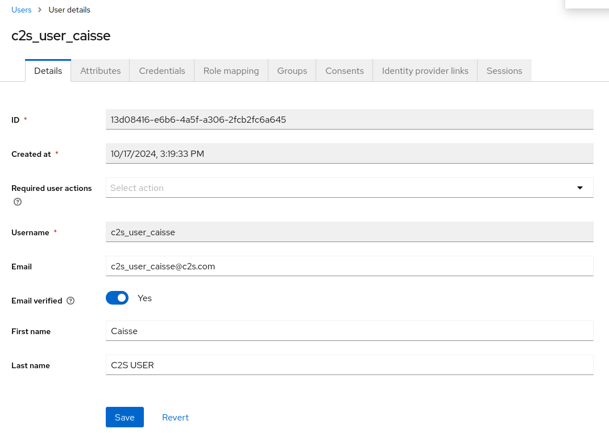

### 5.5. Définition des credentials

1. Allez dans **Credentials**.
2. Définissez un mot de passe, décochez **Temporary**, et sauvegardez.

### 5.6. Attribution des rôles de “c2s_user_caisse”

1. Allez dans **Role mappings**.
2. Attribuez le rôle `CAISSE`.

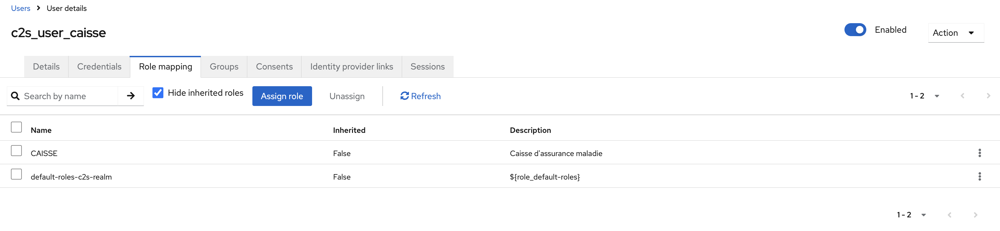

### 5.7. Création de l’utilisateur “c2s_user_oc”

1. Dans **Users**, cliquez sur **Add user**.
2. Remplissez les champs :
   - **Username** : `c2s_user_oc`
   - **Email** : `c2s_user_oc@c2s.com`
   - **First name** : `OC`
   - **Last name** : `C2S USER OC`
   - Cochez **Email verified**.

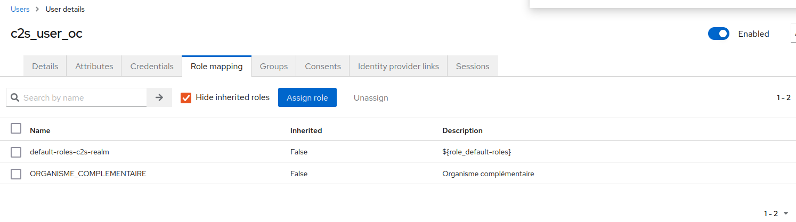

### 5.8. Définition des credentials

1. Allez dans **Credentials**.
2. Définissez un mot de passe, décochez **Temporary**, et sauvegardez.

### 5.9. Attribution des rôles de “c2s_user_oc”

1. Allez dans **Role mappings**.
2. Attribuez le rôle `ORGANISME_COMPLEMENTAIRE`.

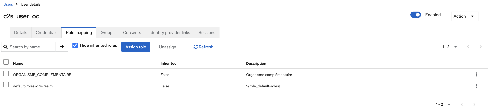

### 5.11. Création de l’utilisateur “c2s_user_moderateur”

1. Dans **Users**, cliquez sur **Add user**.
2. Remplissez les champs :
   - **Username** :

`c2s_user_moderateur`

- **Email** : `c2s_user_moderateur@c2s.com`
- **First name** : `Moderateur`
- **Last name** : `C2S USER`
- Cochez **Email verified**.

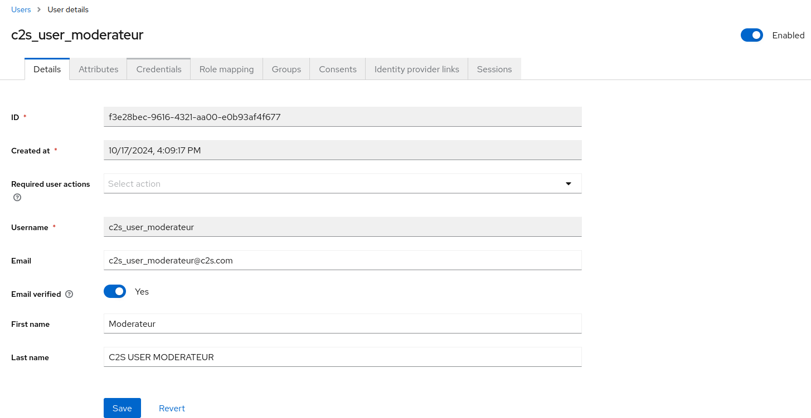

### 5.12. Définition des credentials

1. Allez dans **Credentials**.
2. Définissez un mot de passe, décochez **Temporary**, et sauvegardez.

### 5.13. Attribution des rôles de “c2s_user_moderateur”

1. Allez dans **Role mappings**.
2. Attribuez le rôle `MODERATEUR`.

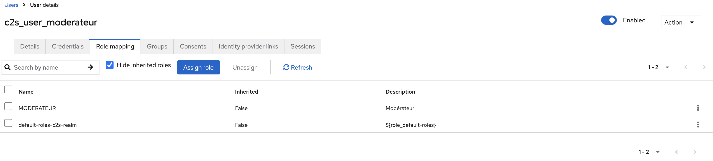

---

## 6. Connexion à l’application front-end

Pour tester les configurations, accédez à `http://localhost:5173/mon-espace/oc`.

---

This version includes the "CAPTURE" instructions, which will guide you on where to add the screenshots.
